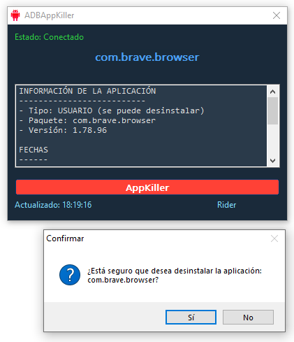

 ADBAppKiller

[](https://opensource.org/licenses/MIT)
[](https://www.autoitscript.com)
[]()

**Herramienta para la gestión de aplicaciones Android via ADB**



## 🌟 Características Principales
- 🔍 Detección en tiempo real de la app en primer plano
- 📊 Extracción de metadata completa (versión, UID, rutas)
- 🗑️ Desinstalación segura de apps de usuario
- 🛡️ Protección contra eliminación de apps de sistema
- 📋 Copiado automático de información al portapapeles

## 📋 Requisitos del Sistema

| Componente       | Versión Mínima       |
|------------------|----------------------|
| Windows          | 7 SP1 (x64)          |
| AutoIt           | 3.3.14.5             |
| ADB              | 33.0.3               |
| Android API      | 26 (8.0 Oreo)        |

## 🚀 Instalación Rápida

1. **Prerrequisitos**:
   - [Android Platform-Tools](https://developer.android.com/studio/releases/platform-tools)
   - [AutoIt v3.3.14.5+](https://www.autoitscript.com/site/autoit/downloads)

2. **Ejecución**:
```bash
# 1. Instalar dependencias (Windows)
choco install autoit adb -y

# 2. Clonar repositorio
git clone https://github.com/RiderCalcina/ADBAppKiller.git

# 3. Ejecutar aplicación
cd ADBAppKiller
autoit3 src/ADBAppKiller.au3
